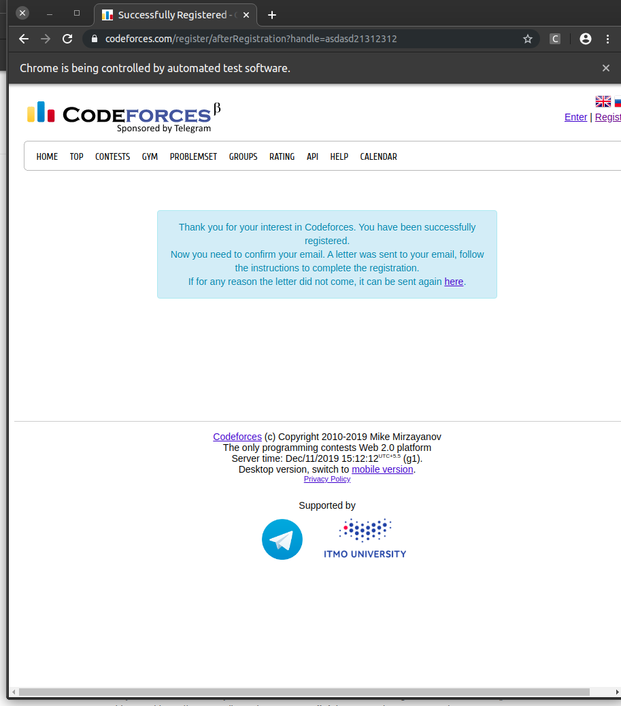
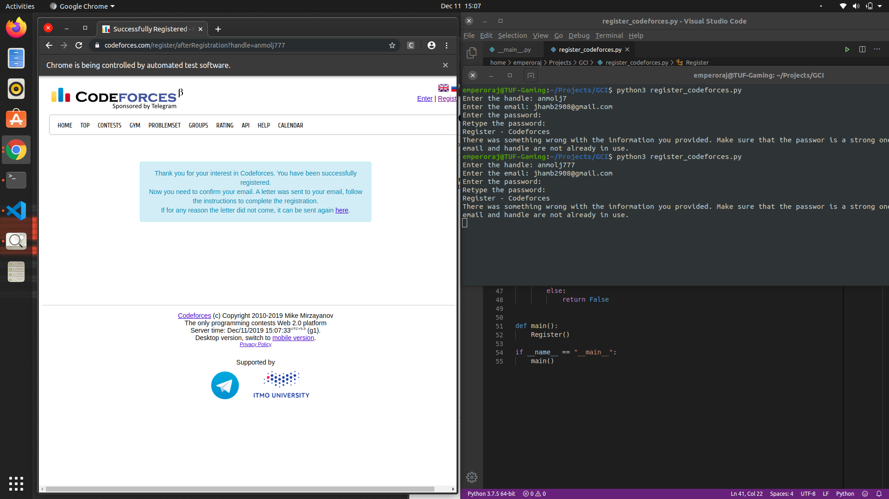

# code_forces_reg
A script that automatically register a codeforces account! 
<h1>Instructions</h1>
Make sure that selenium is intalled, in your computer, and make sure you have chromedriver installed, after all the requirements, to run the script, just type python3 register_codeforces.py and the terminal will ask for all the inputs.

